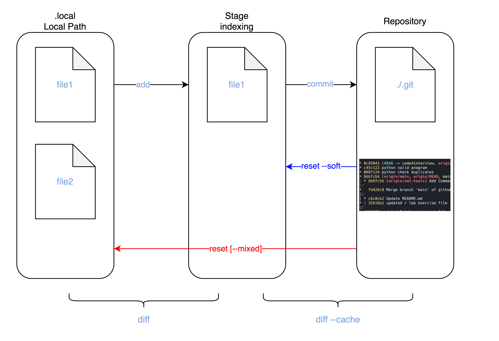

# Git-Rollback

As the most successful(used) VCS (Verison Control System), It's essential to have the capabilities to control versions of the project/codebase. 

There're typically 3 (categories) of commands to rollback in Git:

* git `Checkout`
* git `Reset`
* git `Revert`

Before understanding the functionalities of each of the magic commands. Its essential to understand the structure of a Github Repository and how it works in a high level.

There're 3 imaginary separate area in a folder contains git repository.

* Folder itself
* Staging Area
* .git repository



Git Checkout
---
Git Checkout can switch any branches in a read-mode. 

Using the command lines plus SHA(Security Hash Algorithm), you can go back to any previous version of the project in detached mode
Here's a quick example


```bash
git chekcout f953fb1
```

```
Terminal Output
---
A	file1.py
A	file2.py
Note: switching to 'f953fb1'.

You are in 'detached HEAD' state. You can look around, make experimental
changes and commit them, and you can discard any commits you make in this
state without impacting any branches by switching back to a branch.

If you want to create a new branch to retain commits you create, you may
do so (now or later) by using -c with the switch command. Example:

  git switch -c <new-branch-name>

Or undo this operation with:

  git switch -

Turn off this advice by setting config variable advice.detachedHead to false

HEAD is now at f953fb1 Initial Handshake
```

## Git Checkout Rollback
However, `git checkout [filename]` can also abandon the previous change that you made to Tracked File in Git
In above case -- if you want to abandon all the changed we made to `file1.py `

```bash
$ git add file1.py    
$ ... make some changes to file1.py
$ git checkout file1.py
```


